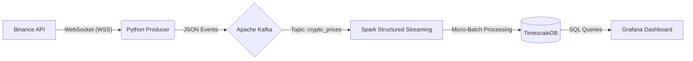
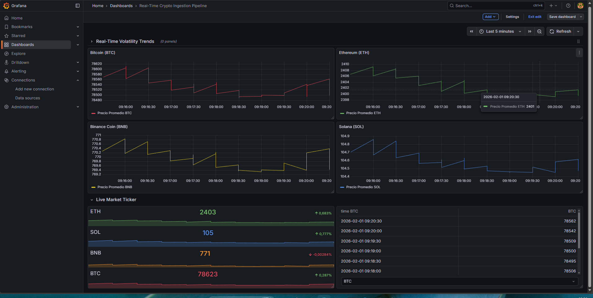

# Real-Time Crypto Market Surveillance & Anomaly Detection
> **Real-time Crypto Dashboard for Investment Decision Making & Volatility Analysis.**

## 🏗️ Architecture Diagram

The data flow follows a simplified **Kappa** architecture, designed for low latency and high availability:



## 📊 Final Dashboard Preview


> *Live Grafana dashboard monitoring 4 cryptocurrencies in real-time with sliding window anomaly detection.*

## 🛠️ Technologies Used


## 💡 Description & Motivation

**Why this project?**
In financial markets, latency is money. Traditional polling systems (querying an API every X seconds) miss critical information during volatility spikes. My goal with this project was to build an infrastructure capable of **transforming raw, unpredictable data into actionable real-time insights**.

This pipeline doesn't just ingest prices; it "listens" to the market via WebSockets, calculates volatility metrics on the fly, and allows an analyst to visualize anomalies the very second they occur, facilitating informed Data-Driven Decisions.

## 🔄 Data Flow

The pipeline processes High-Frequency Financial Data following these steps:

1.  **Source (Ingestion):** A **Python** client connects to Binance WebSockets (`wss://stream.binance.com`) to receive price updates (Push) instead of requesting them (Pull), reducing latency to milliseconds.
2.  **Ingestion (Buffer):** Events are sent to **Apache Kafka**, acting as a decoupled buffer, ensuring no traffic spike saturates the processing system and allowing for data replay.
3.  **Processing (Business Logic):** **Spark Structured Streaming** consumes events from Kafka. It applies **Sliding Time Windows** of 2 minutes to calculate moving averages and filter market noise.
4.  **Storage (Persistence):** Processed results are written to **TimescaleDB** (optimized PostgreSQL), which uses automatic partitioning (Hypertables) and retention policies to handle millions of records efficiently.
5.  **Visualization (Serving):** **Grafana** queries the database to render an operational Dashboard showing trends, live tickers, and volatility alerts.

## 🚀 Setup / How to Run

The entire project is containerized. Follow these steps to run it locally:

### Prerequisites
* Docker & Docker Compose
* Python 3.9+

### 1. Start Infrastructure
```bash
docker-compose up -d
```

### 2. Database Configuration (First time only)
Initialize Hypertable and retention policies in TimescaleDB:
```bash
docker exec -it postgres_crypto psql -U admin -d crypto_db -c "
CREATE TABLE crypto_alerts (
    window_start TIMESTAMP NOT NULL,
    window_end TIMESTAMP NOT NULL,
    symbol VARCHAR(10) NOT NULL,
    avg_price DOUBLE PRECISION,
    ingest_timestamp TIMESTAMP DEFAULT CURRENT_TIMESTAMP
);
SELECT create_hypertable('crypto_alerts', 'window_end');
SELECT set_chunk_time_interval('crypto_alerts', INTERVAL '1 day');
SELECT add_retention_policy('crypto_alerts', INTERVAL '1 day');
CREATE INDEX ON crypto_alerts (symbol, window_end DESC);
"
```

### 3. Install Dependencies & Run
```bash
python3 -m venv venv
source venv/bin/activate
pip install kafka-python-ng pyspark==3.5.0 websocket-client

# Terminal 1: Producer (Ingestion)
python3 websocket_producer.py

# Terminal 2: Processor (Spark Job)
python3 processor.py
```

### 4. View Dashboard
Access `http://localhost:3000` (User: `admin` / Pass: `admin`). The dashboard is pre-loaded.

